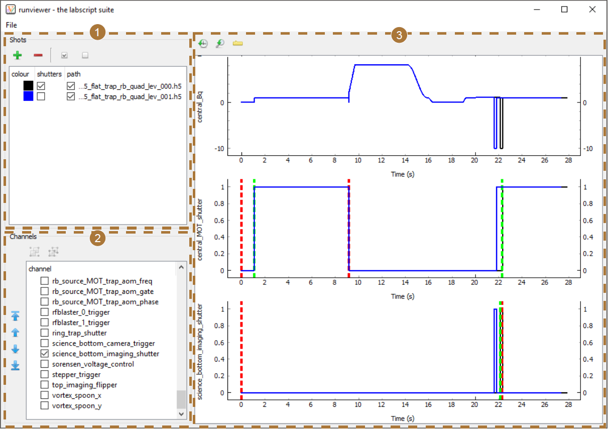

Usage
=====

While the textual based interface of labscript is ideal for defining experiment logic in ‘high
level’ terms, there can often be a discrepancy between what was intended and what was
actually commanded. This is particularly prevalent in situations where more complex control
flow features (such as while loops or parameterised function) are used as this increases
the abstraction between the language used to command the output and the actions of the
output. Runviewer exists to bridge this gap, allowing us to maintain the benefits of textual
control of the experiment without losing the benefits of the graphical representation of the
experiment logic. Runviewer achieves this by producing a series of plots containing the
output state for each channel. These plots are ‘reverse-engineered’ from the hardware instructions
stored in the hdf5 file, and are thus a faithful representation of what each output
channel should do during an experiment (provided of course that the reverse engineering
code is accurate).
There are thus several uses for runviewer. The most important is the ability to graphically
observe the experiment logic. This allows a user to easily observe experiment features
such as the shape of complex ramps or the synchronisation between events on different
channels. Runviewer also supports simultaneous display of traces from multiple shots providing,
for example, a means to see how an output trace changes when a global variable is
adjusted. Finally, comparisons between expected output in runviewer, and observed output
on an oscilloscope can make debugging hardware problems quicker.

Generating output traces
------------------------

Runviewer generates the displayed output traces by processing the hardware instructions
stored in the hdf5 shot file. We specifically reconstruct the output from the lowest level
description of the experiment logic in order to accurately represent what the output hardware
will do during an experiment. In order to support a diverse range of hardware, part 
of the reconstruction process is handled by device specific code that must be written by a
developer when adding support for a new device. This device specific code simulates how
the device processes hardware instructions and updates output states. It is discussed in
more detail in :doc:`labscript-devices <labscript-devices:index>`, so for the purposes of this 
section we’ll only cover generally what such
code should do. The reconstruction algorithm is then as follows:

#. The master pseudoclock device is identified from the HDF5 file.
#. We import the device specific runviewer class for the master pseudoclock and request that it  generate the traces for its outputs. As this is the master pseudoclock, we instruct the device specific code that there is not anything controlling the timing of this device (the need to do this will become apparent in a later step).
#. | The device specific code generates a set of output traces (as it sees fit) and returns these traces to runviewer by calling a provided runviewer method, indicating that these traces should be available for display. This allows the device to produce as many traces as it likes, without limitation by the runviewer architecture. This is critical, as it removes the need for runviewer to support specific output types. Instead, this support is baked-in to the device specific code, which should already be aware of the output capabilities of the device.
   |
   | If timing information was provided by runviewer (which is the case for all devices except the master pseudoclock, see step 5 below), then it is used by the device code to generate the correct timing of the output traces. For example, a Novatech DDS9m only stores a table of output state changes, so the timing information of the parent ClockLine is needed. Similarly, the timing of a secondary pseudoclock is dependent on state changes to the parent Trigger line.
#. The device specific code then returns, to runviewer, a dictionary of traces for any ClockLines or Triggers assigned to digital outputs of the device (which may or may not have already been provided to runviewer for display in the previous step).
#. Runviewer iterates over this dictionary, and finds all devices that are children of each ClockLine or Trigger. For each device, the device specific code is imported and called as in step 2, except that this time we provide the device specific code with the trace for the ClockLine or Trigger so that it can generate output traces with the correct timing. The device specific code then follows step 3 and runviewer repeats steps 3 to 5 recursively until all devices have been processed.

The graphical interface
-----------------------

The graphical interface of runviewer comprises 3 sections (see :numref:`fig-overview`). The first section
manages the loading of shots into runviewer. Here you can enable (or disable) shots for
plotting, choose the plot colour, and choose whether markers for shutter open and close
times should be displayed. The second section manages the channels that are to be plotted.
These channels can be reordered using the controls to the left, which then affects the order
in which the plots appear. The list displays the union of all channels from shots that
are currently enabled or have been previously enabled. This ensures runviewer remembers
selected channels, even if they do not exist in the current shot, removing the need for a user
to constantly re-enable channels when switching between different types of experiments.
The configuration of enabled channels can also be saved and loaded from the ‘File’ menu,
which is a useful aid when switching between regularly-used experiments.

.. _fig-overview:

    The runviewer interface consists of 3 main sections. (1) Controls for loading
    shots, selecting the colour of traces, selecting whether shutter open/close markers are to
    be shown, and whether the output traces from this shot should be shown. Note that we
    have only enabled shutter markers for one of the two shots loaded (the black trace). (2) A
    reorderable list of channels contained within the loaded shots. The order here determines
    the order of plots in (3). Only enabled channels will be displayed in (3). (3) Plots of the
    output traces for the selected channels in the selected shots. Here we show data from 2 shots
    of a real experiment sequence from the Monash lab used to study vortex clustering dynamics [2]_.
    The two shots loaded demonstrate how you can observe differences in output between shots
    in a sequence (in this case due to varying the time between stirring and imaging the vortex
    clusters). In this figure we display the entire length of the trace, which makes it difficult
    to distinguish between the shutter open/close events (red and green dashed, vertical lines)
    and the digital output trace. The discrepancy between these events becomes more apparent
    when zooming in (see :numref:`fig-detail`).

The third section comprises the plotting region. We use the Python plotting library
:doc:`pyqtgraph <pyqtgraph:index>` to generate the plots. This choice was primarily made due to the performance
of pyqtgraph, which is significantly faster than other common Python plotting libraries
such as matplotlib. [3]_ The user can pan and zoom the plots produced by pyqtgraph using
the mouse (by holding left or right mouse button respectively while moving the mouse).
The time axes of each plot are linked together so that multiple output traces can be easily
compared to each other. Two buttons are then provided at the top of the interface for
resetting the axes to the default scaling.

As discussed previously, the output traces are generated directly from the hardware
instructions. This creates two problems: information about the timing of certain events
may not be contained within the hardware instructions, and the output trace may contain
too many data points to plot efficiently (even when using pyqtgraph). The first problem
we solve by plotting vertical markers at points of interest. For example, the Shutter class
automatically accounts for the open and close delay of a shutter. The output trace thus
only captures the time at which the digital output goes high or low and does not capture
when the shutter will be open or closed. Runviewer reverse engineers these missing times
from metadata stored within the hdf5 so that they can be plotted as markers
of interest (see :numref:`fig-detail`).

.. _fig-detail:

.. figure:: img/runviewer_detail.png 

    Here we show the same traces as in :numref:`fig-overview`, but zoomed just after the
    22 s mark. We can now clearly see the difference between the change in digital state (black
    trace) used to open and close the shutter, and the time at which the shutter was actually
    commanded to open and close (green and red dashed, vertical lines respectively). In this
    case, the shutter (open, close) delay was specified in the labscript file as (3.11, 2.19) ms for
    the central_MOT_shutter and (3.16, 1.74) ms for the science_bottom_imaging_shutter.

The second problem is solved by dynamically resampling the output traces depending
on the zoom level of the x-axis of the plots. I wrote a feature-preserving algorithm for
this purpose to avoid the many down-sampling algorithms that miss features faster than
the sampling rate. This ensures that zoomed out plots accurately represent the trace, even
when resampled. The algorithm starts by creating an output array of points that is 3 times
the maximum width, in pixels, that the plot is expected to be displayed at. We fill every
third data point in the output array using ‘nearest neighbour on the left’ interpolation, using
only the section of the output trace that is currently visible. We then fill the other two data
points with the highest and lowest value between the first data point and the 4th data
point (which will also be determined using ‘nearest neighbour on the left’ interpolation).
These two data point are placed in the order in which they appear, the reason for which
will become clear shortly. This is repeated until the output array is full. The output array
is then passed to pyqtgraph for plotting. Fast features thus exist in three data points of
the array, which pyqtgraph correctly plots in one pixel as a vertical line. This is similar to
the way digital oscilloscopes display acquired signals.

Despite our optimisation efforts, resampling still takes a significant period of time, particularly
if there are many plots displayed. We thus perform the resampling in a thread in
order to keep the GUI responsive. However, because the resampled data has more points
than can be displayed, and these points are in the correct order, zooming in still immediately
shows a reasonable approximation of the trace while the user waits for the resampling
to complete in the background.

.. rubric:: Footnotes

.. [1] Documentation taken from Phillip T. Starkey *A software framework for control and automation of precisely timed experiments*
    Thesis, Monash University (2019) https://doi.org/10.26180/5d1db8ffe29ef

.. [2] S. P. Johnstone, A. J. Groszek, P. T. Starkey, C. J. Billington, T. P. Simula, and
    K. Helmerson. *Evolution of large-scale flow from turbulence in a two-dimensional
    superfluid* Science **364**, 1267 (2019) https://doi.org/10.1126/science.aat5793

.. [3] We typically use matplotlib in the labscript suite as it is a widely known package with an almost
    identical syntax to MATLAB. This means that many users are already familiar with the syntax needed
    to create plots. As the user is not required to write or modify the code that generates the plots
    in runviewer, this benefit was not applicable and so it was worth using pyqtgraph for the increased
    performance.